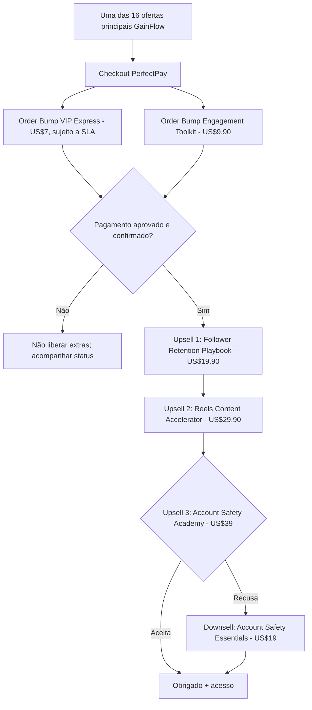

# Proposta de Funil GainFlow — 3 upsells e 1 downsell

**Status: proposta comercial. Nenhuma configuração de cobrança ou rota existente é alterada por este documento.**

Base revisada: o projeto possui 16 checkouts principais cadastrados, dois Order Bumps com links oficiais informados, e páginas técnicas para quatro upsells e um downsell. Todos os cinco checkouts pós-compra em `sales/upsell-checkouts.json` permanecem vazios, os cinco status estão `pending_validation`, e `sales/config.json` declara `oneClickEnabled: false`. A liberação por webhook e o One Click ainda não estão validados.

## Público e lógica da compra

Pessoa compra um pacote de seguidores, com versões Standard/Niche. A oferta pós-compra precisa tratar problemas novos e concretos: entender resultados reais, criar conteúdo útil para a audiência e proteger sua conta. As informações da oferta principal e serviços adicionais precisam corresponder à capacidade real de entrega. Não prometer crescimento, retenção, algoritmo ou proteção garantidos.

## Fluxo proposto (fase 1: testar 3 upsells)

As opções de Order Bump são opcionais dentro do mesmo checkout; o diagrama separa visualmente as duas ofertas, não implica duas compras obrigatórias. A navegação não comprova pagamento e não efetua automaticamente cobrança One Click.

### Upsell 1 — Follower Retention Playbook, US$ 19,90
- **Reutilizar** produto existente `upsell-4`, **mas mudar a ordem** após confirmação da compra.
- Valor: planilha de acompanhamento de métricas, plano de acompanhamento de 30 dias e orientações de conteúdo consistente e qualidade de audiência; sem prometer reter seguidores artificialmente.
- Benefício imediato: acompanhar e avaliar a evolução do perfil após comprar o pacote principal.
- Verificar que o comprador não recebe esse mesmo material no plano base.

### Upsell 2 — Reels Content Accelerator, US$ 29,90
- **Proposta de substituição** do atual `upsell-2` Profile Verification Toolkit. Exige aprovação explícita antes de mudar código, nomes, URLs ou cadastro na PerfectPay.
- Entregáveis a produzir e verificar: 30 ideias de Reels, scripts por nicho, modelos editáveis de legendas/ganchos e calendário prático de 30 dias.
- Diferenciação: todos os compradores já têm Reels Academy; esta oferta deve adicionar **ativos utilizáveis prontos**, não repetir aulas já incluídas.
- Promessas de resultados ou 'viralizar garantido' não devem ser feitas.

### Upsell 3 — Account Safety Academy, US$ 39,00
- **Reutilizar** o atual `upsell-1`, **mudar a ordem** para terceira oferta.
- Conteúdo sobre 2FA, phishing, recuperação e higiene de acesso, sem alegações de prevenção garantida de bloqueios.
- Se rejeitar: mostrar o **downsell existente** `downsell-1` Account Safety Essentials, US$ 19,00, sem adicionar cobrança automática.
- Evitar vender duas ofertas de segurança quase idênticas em sequência.

### Oferta existente que não recomendo ativar na fase 1
- `upsell-3` Advanced Profile Protection, US$ 29,90: sobrepõe Account Safety Academy. Deixar fora do fluxo inicial ou transformar em um novo produto com entrega claramente distinta, por exemplo, **Profile Conversion Toolkit**, apenas depois de validar a estratégia.

## Entradas condicionais e economia unitária

- Preservar os 16 URLs de checkout existentes e seus modos Standard/Niche. Não mexer no mapeamento sem auditar o caso de um plano Starter Niche dentro de um produto Growth na PerfectPay.
- Para entradas de US$14,90 e US$22,35, testar os preços e a relevância dos primeiros upsells. Não forçar a mesma sequência para compras high ticket sem medir aceite.
- Como experimento futuro: variante de Upsell 1 (perfil/biografia/CTA) em vez de retenção, comparando taxa de aceite, reembolso, receita líquida por compra aprovada e satisfação.
- Medir `take rate` por etapa, receita incremental média por compra aprovada, reembolsos e suporte; não inferir conversão sem dados.

## Bloqueios reais antes de publicar

1. `sales/upsell-checkouts.json` permanece com todos os cinco valores vazios.
2. `sales/config.json` mantém `oneClickEnabled: false`, porém verificar a página principal: o bundle `assets/index-perfectpay-v4.js` pode acrescentar o parâmetro `upsell=true` ao checkout independentemente desse controle. Revisar e padronizar, sem ativar One Click prematuramente.
3. Os botões de aceite nas páginas `/offer/` estão desabilitados enquanto as ofertas estão `pending_validation`.
4. A PerfectPay precisa vincular os produtos/planos **oficiais** em cada etapa, com páginas e aceitação/recusa compatíveis. Testar rejeição, aceitação e refresh para evitar cobrança duplicada.
5. Webhook PerfectPay → entrega na área de membros, aprovações, reembolsos e idempotência precisam estar configurados e testados com pedidos de teste.
6. Confirmar que os dois Order Bumps estão realmente vinculados aos checkouts principais; links individuais não provam associação. Validar capacidade do fornecedor do VIP Express sem promessa de 3 horas.
7. **Divergência de quantidades**: do Pro em diante, `baseFollowers + bonusFollowers` não coincide com `totalFollowers` no catálogo. Resolver anúncio vs entrega antes de escalar.
8. Titularidade dos pixels, Purchase após aprovação e deduplicação precisam de IDs confirmados.
9. Publicação/ligação exata do domínio `followergrowth.site` não foi verificada nesta auditoria: a inspeção direta da página pública falhou.

## Checklist de implementação futuro (requer aprovação)
- [ ] Confirmar a sequência e preços com o proprietário
- [ ] Criar/validar entregáveis exclusivos para os três upsells
- [ ] Registrar links reais, códigos oficiais de produto e plano
- [ ] Implementar a nova ordem nas páginas, sem quebrar URLs existentes
- [ ] Configurar a PerfectPay e o One Click validado
- [ ] Testar pelo menos uma compra ponta a ponta com todos os caminhos de aceite/recusa
- [ ] Ativar em pequeno volume, acompanhar taxas de aceite, reembolso e entregas
